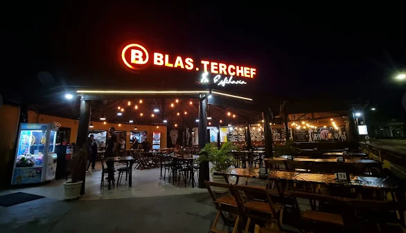

# 🔥 Ponto do Assado

<div align="center">



**Frangos Assados e Sobremesas da Sara**

[](https://nextjs.org/)
[](https://react.dev/)
[](https://www.typescriptlang.org/)
[](https://tailwindcss.com/)

</div>

---

## 📖 Sobre

Site oficial do **Ponto do Assado** — frango assado na brasa e bolos artesanais da Sara. Este repositório contém o código-fonte do site, desenvolvido com tecnologias modernas de desenvolvimento web.

### 🎯 Funcionalidades

- **🍗 Cardápio interativo** — navegue pelo menu completo com fotos dos pratos
- **📍 Localização** — R. Darzizo Crivelaro, 170
- **📱 Design responsivo** — otimizado para celular, tablet e desktop
- **⚡ Performance** — construído com Next.js e otimizado para velocidade
- **🛒 Carrinho de compras** — sistema de pedidos integrado
- **🔍 SEO otimizado** — metadados e dados estruturados para buscadores

---

## 🕐 Horário de Funcionamento

| Dias | Horário |
|------|---------|
| Segunda a Quinta | 18:00 — 23:00 |
| Sexta a Domingo | 18:00 — 00:00 |

---

## 🛠️ Stack

- **[Next.js 15](https://nextjs.org/)** — framework React com App Router
- **[React 19](https://react.dev/)** — biblioteca de componentes UI
- **[TypeScript 5](https://www.typescriptlang.org/)** — tipagem estática
- **[Tailwind CSS 4.1](https://tailwindcss.com/)** — estilização utility-first
- **[pnpm](https://pnpm.io/)** — gerenciador de pacotes

---

## 📦 Instalação

### Pré-requisitos

- Node.js 18+
- pnpm

### Como rodar

```bash
# Clonar o repositório
git clone https://github.com/RLluna12/assado.git

# Entrar na pasta
cd assado

# Instalar dependências
pnpm install

# Rodar em desenvolvimento
pnpm dev

# Acessar http://localhost:3000
```

### Scripts disponíveis

```bash
pnpm dev      # Servidor de desenvolvimento
pnpm build    # Build de produção
pnpm start    # Servidor de produção
pnpm lint     # Verificar código
```

---

## 📂 Estrutura do Projeto

```
assado/
├── app/                    # Páginas (Next.js App Router)
│   ├── page.tsx           # Página principal
│   ├── layout.tsx         # Layout raiz
│   ├── globals.css        # Estilos globais
│   ├── agb/               # Termos de uso
│   ├── datenschutz/       # Política de privacidade
│   └── impressum/         # Aviso legal
├── components/            # Componentes React
│   ├── header.tsx         # Cabeçalho
│   ├── hero.tsx           # Seção principal
│   ├── menu-section.tsx   # Cardápio
│   ├── menu-category.tsx  # Cards do menu
│   ├── cart-drawer.tsx    # Carrinho de pedidos
│   ├── location-section.tsx # Localização e horários
│   ├── contact-section.tsx  # Contato
│   └── footer.tsx         # Rodapé
├── contexts/
│   └── cart-context.tsx   # Contexto do carrinho
├── public/
│   ├── graphics/          # Logos e imagens
│   ├── burgers/           # Fotos dos pratos
│   └── Appetizers/        # Fotos das entradas
└── README.md
```

---

## 📞 Contato

- **Telefone:** (11) 95436-4018
- **Endereço:** R. Darzizo Crivelaro, 170 — SP

---

<div align="center">

Feito com 🔥 para o Ponto do Assado

</div>
